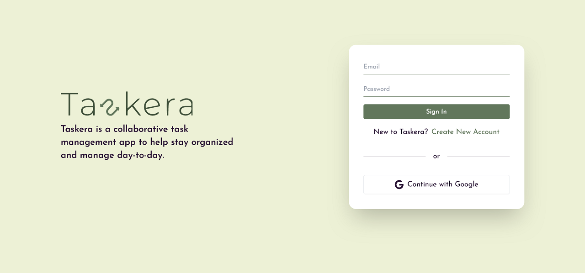

### Taskera (A Collaborative Task Management Website)

#### Tech:

React, React Router, DND, Axios, Redux, Firebase, Imagekit, Tailwind, Formik, YUP.

#### Feature:

- Users can assign task to anyone.
- Users can easily view their assign task and update if needed.
- Users can update their task status by drag and drop.

###### [Live](https://taskera.netlify.app)

#### Getting Started (Locally):

Firstly, clone this repository on your local machine using below command:

`git clone https://github.com/khalidccnu/taskera.git`

Secondly, in the project directory, you will need to install dependencies. So, run below command wherever required:

`npm install`

After install dependencies, you will need to create all environment variables.

##### Environment Variables (Client Side)

You will need to create a .env.local file using following environment variables

`VITE_API_URL=YOUR_API_URL`
`VITE_IK_ID=YOUR_IMAGEKIT_ID`
`VITE_FB_API_KEY=YOUR_FIREBASE_API_KEY`
`VITE_FB_AUTH_DOMAIN=YOUR_FIREBASE_AUTH_DOMAIN`
`VITE_FB_PROJECT_ID=YOUR_FIREBASE_PROJECT_ID`
`VITE_FB_STORAGE_BUCKET=YOUR_FIREBASE_STORAGE_BUCKET`
`VITE_FB_MESSAGING_SENDER_ID=YOUR_FIREBASE_MESSAGING_SENDER_ID`
`VITE_FB_APP_ID=YOUR_FIREBASE_APP_ID`

##### Environment Variables (Server Side)

You will need to create a .env file using following environment variables

`IK_ID=YOUR_IMAGEKIT_ID`
`IK_PL_KEY=YOUR_IMAGEKIT_PUBLIC_KEY`
`IK_PV_KEY=YOUR_IMAGEKIT_PRIVATE_KEY`

To run this project after successful all process, you will need to run below command

`npm start`
